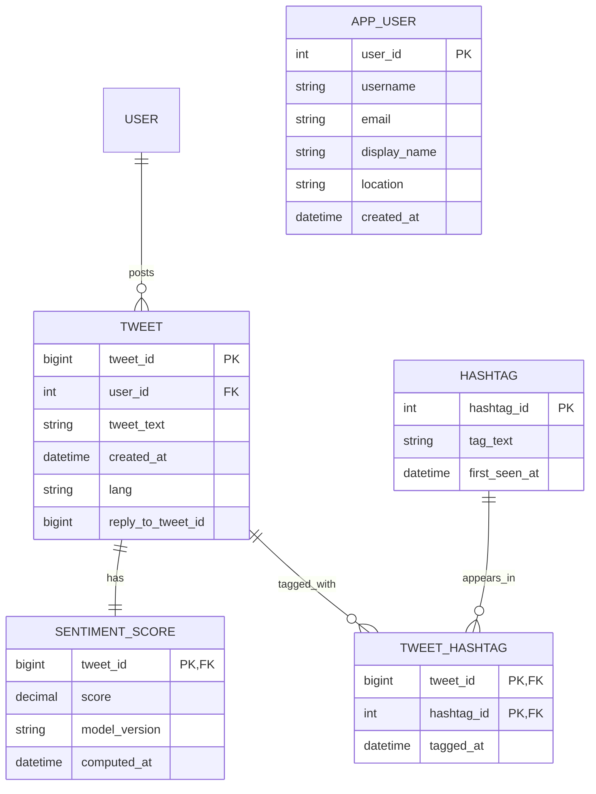

# Database ER Diagram — Social Analytics

## User Groups
- Analyst / Data Scientist
- Marketing / Brand Team
- System Administrator

---

## ER Diagram


---

## Part C: Final Normalized Relational Schema (BCNF)

All relations pass BCNF because each nontrivial FD has a determinant that is a primary key or candidate key. This means that no decomposition was required.

### Final Schema

- **APP_USER**(user_id PK, username, email UNIQUE, display_name, location, created_at)
- **TWEET**(tweet_id PK, user_id FK→APP_USER.user_id, tweet_text, created_at, lang, reply_to_tweet_id FK→TWEET.tweet_id NULL)
- **HASHTAG**(hashtag_id PK, tag_text UNIQUE, first_seen_at)
- **TWEET_HASHTAG**(tweet_id PK/FK→TWEET.tweet_id, hashtag_id PK/FK→HASHTAG.hashtag_id, tagged_at)  
  PK = (tweet_id, hashtag_id)
- **SENTIMENT_SCORE**(tweet_id PK/FK→TWEET.tweet_id, score, model_version, computed_at)

### Functional Dependencies

- APP_USER: user_id → username, email, display_name, location, created_at; email → user_id (email unique)
- TWEET: tweet_id → user_id, tweet_text, created_at, lang, reply_to_tweet_id
- HASHTAG: hashtag_id → tag_text, first_seen_at; tag_text → hashtag_id (tag_text unique)
- TWEET_HASHTAG: (tweet_id, hashtag_id) → tagged_at
- SENTIMENT_SCORE: tweet_id → score, model_version, computed_at


### Revised ER Diagram

```mermaid
erDiagram
    APP_USER ||--o{ TWEET : posts
    TWEET ||--|| SENTIMENT_SCORE : has
    TWEET ||--o{ TWEET_HASHTAG : tagged_with
    HASHTAG ||--o{ TWEET_HASHTAG : appears_in
